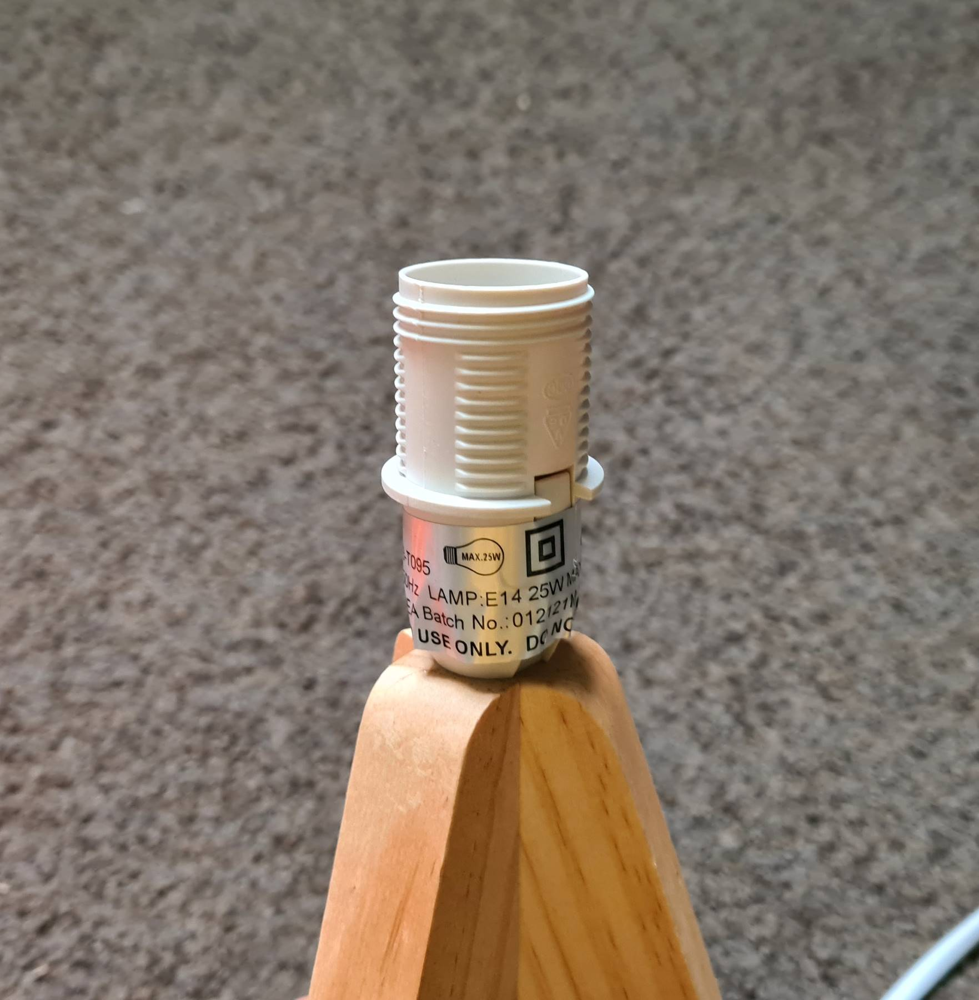
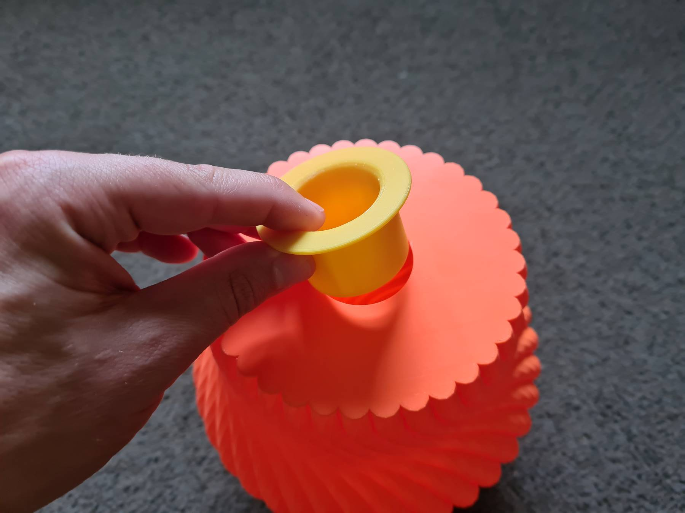
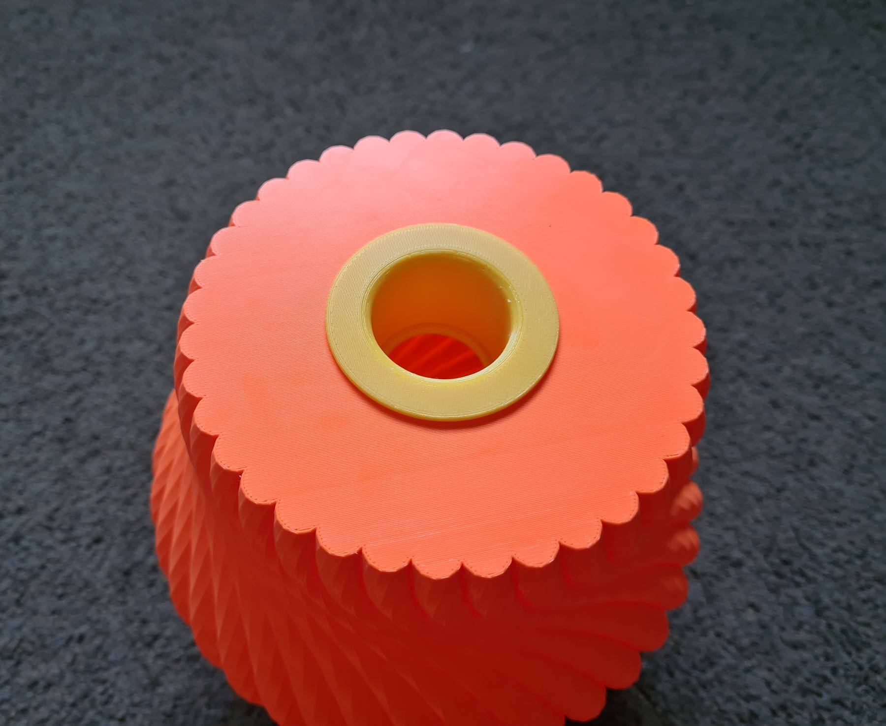
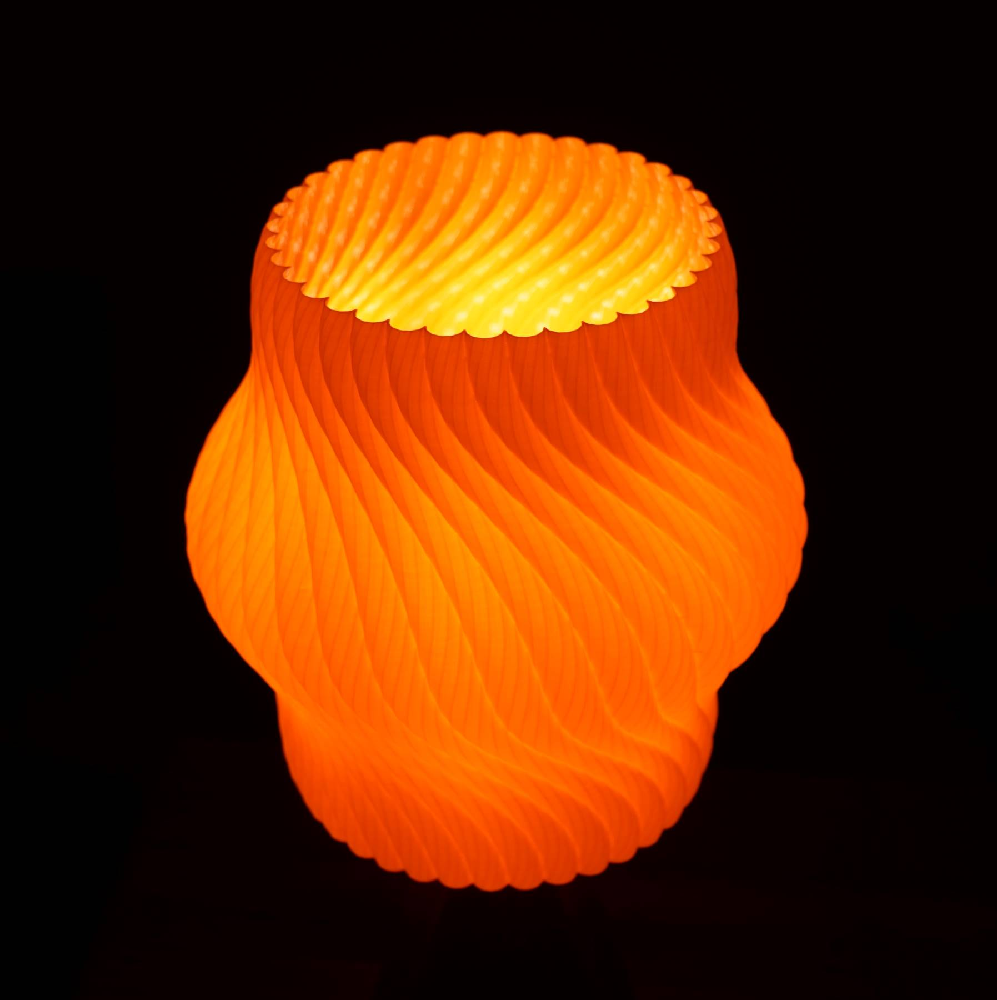
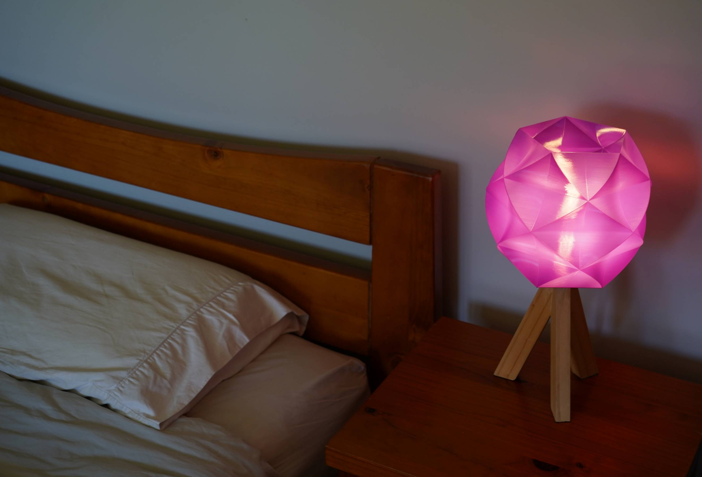
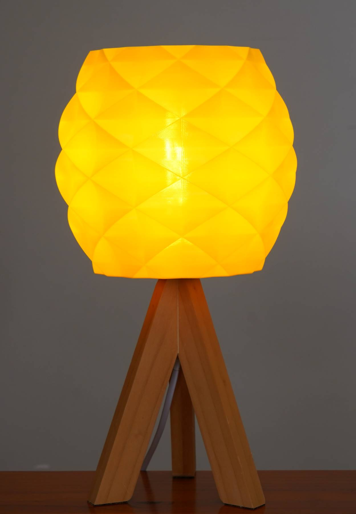

# Lampshades
A collection of 3D printable lampshades designed in OpenSCAD. More information on my [website](tartartech.xyz/lampshades) and STLs on [Printables](https://www.printables.com/social/308094-mjseabright/collections/207685).

## Where Are The STLs
They are [here](https://www.printables.com/social/308094-mjseabright/collections/207685). Some of them are quite big files, so they are hosted on Printables rather than GitHub. 

## Editing the Designs
All of the designs are done in [OpenSCAD](https://openscad.org/), so just [download](https://openscad.org/downloads.html) and install OpenSCAD and get to work. Each design has parameters for the main dimenions which makes them easily customisable. I suggest you change the layer height parameter to something like 2mm (rather than 0.2mm) while playing around with designs as it will be much quicker. Then change it back for the final render. 

The [noise](noise/) design is different as it uses [Python](https://www.python.org/) to generate a SCAD file that then gets rendered via OpenSCAD. Changes can be made via the parmeters at the top of the [noisey_generator.py](noise/noisey_generator.py) file. Running it will generate a new [noisey.scad](noise/noisey.scad) file, which can then be rendered by OpenSCAD.

## Lamp Compatibility
I designed the lampshades to work with standard shade mounting systems. I've been using lamp bases that take an E14 bulb and have a ~28mm diameter male thread for the shade mounting. The [adaptor](adaptor/adaptor.scad) dimensions can be adjusted to fit larger light sockets.

Here is a picture of the socket on the lamp base I have been using:

## Print Settings and Tips
All of these lampshades are designed to be printed in vase mode (single wall spiral printing). I used the following settings and found they worked well:
- Material: PETG (PLA works fine but may warp if you use an incandecent bulb or leave it in direct sunlight)
- Layer height: 0.2mm
- Line width: 0.6mm
- Solid bottom layers: 6
- Some of the designs look good using the ['fuzzy skin'](https://help.prusa3d.com/article/fuzzy-skin_246186) feature of PrusaSlicer or Cura

Print both the lampshade you like and the [adaptor](adaptor/adaptor.scad). I print the adaptor with normal settings (ie. not vase mode). I ususally use PETG and a 0.3mm layer height. It does require supports unfortunatly. Then glue the adaptor into the bottom of the lampshade with CA glue. Here are some pictures to show you what I mean:

## Photos
See the [photos](photos/) folder for more photos of the designs.

